# Спецификация: Синхронизация терминальной сессии и мобильного приложения (Этап 3)

## 1. Введение и цели

### Проблема
1. **Параллельные сессии:** При отправке сообщения из Android-приложения шлюз `agy-gateway` запускал изолированный фоновый процесс `agy -p ... --conversation <id>`. Если на сервере в `tmux` уже была открыта интерактивная сессия `agy` с этой же беседой, сообщения из приложения в терминале не появлялись — создавалась «параллельная сессия».
2. **Отсутствие real-time синхронизации:** Когда пользователь работал в SSH/Termius через `agy`, шлюз `agy-gateway` не отслеживал файл транскрипта (`transcript_full.jsonl`). Мобильное приложение не получало WebSocket-событий (`step`, `agent_activity`) и обновлялось только при выходе на экран списка чатов и повторном входе.

### Главная цель
Обеспечить **идеальную двустороннюю синхронизацию в реальном времени** между активной терминальной сессией на сервере и Android-клиентом:
- Всё, что пишется и выполняется в терминале (Termius), мгновенно транслируется в чат на телефоне (шаги, размышления, вызовы инструментов, ответы).
- Сообщение, отправленное из приложения в активный чат, поступает напрямую в живую сессию терминала без создания параллельных процессов `agy`.
- Интерфейс на телефоне обновляется плавно, непрерывно и в реальном времени.

---

## 2. Архитектура решения

```mermaid
sequenceDiagram
    autonumber
    actor User as Пользователь (Termius / App)
    participant Tmux as Tmux (agy interactive TUI)
    participant Disk as ~/.gemini/antigravity-cli (brain / presence)
    participant Gateway as agy-gateway (Watcher & Injector)
    participant App as Android Client (SyncEngine & Room)

    rect rgb(30, 40, 60)
    note over User,App: Сценарий А: Пользователь пишет в Termius
    User->>Tmux: Ввод промпта с клавиатуры
    Tmux->>Disk: Запись шага USER_EXPLICIT в transcript_full.jsonl
    Gateway->>Disk: Inotify / Tail фиксирует новую строку
    Gateway->>App: WS broadcast: step (USER)
    App->>App: Баббл пользователя появляется на экране
    Tmux->>Disk: Генерация ответа: thinking, tool_calls, content
    Gateway->>App: WS broadcast: agent_activity & step (AGENT)
    App->>App: Отображение карточки инструмента / текста ответа в real-time
    end

    rect rgb(40, 50, 40)
    note over User,App: Сценарий Б: Пользователь пишет из Android-приложения
    User->>App: Отправка сообщения + вложений
    App->>Gateway: POST /v1/chats/{id}/messages
    Gateway->>Disk: Проверка fcntl блокировки presence/{id}.lock
    Gateway->>Tmux: tmux load-buffer + paste-buffer + send-keys Enter
    Tmux->>Tmux: Промпт появляется на экране терминала и начинает исполняться
    Tmux->>Disk: Запись в transcript_full.jsonl
    Gateway->>App: WS broadcast: step + agent_activity
    App->>App: Плавная доставка (pending -> delivered ✓✓)
    end
```



---

## 3. Компоненты системы

### 3.1. Детектор активной сессии (`SessionPresenceDetector`)
Определяет, открыта ли конкретная беседа прямо сейчас в интерактивном TUI `agy` на сервере:
- **Lock-файл:** Antigravity CLI держит эксклюзивную файловую блокировку `fcntl.flock(LOCK_EX)` на файле `/root/.gemini/antigravity-cli/presence/<conversation_id>.lock`.
- **Проверка:** Gateway открывает дескриптор этого файла и вызывает `fcntl.flock(fd, fcntl.LOCK_EX | fcntl.LOCK_NB)`.
  - Если брошено исключение `BlockingIOError` (или `EWOULDBLOCK` / `EAGAIN`) — сессия **активно открыта** в интерактивном процессе `agy`.
  - Если блокировка успешно захвачена — сессия **не активна** в интерактивном терминале (Gateway тут же освобождает блокировку `fcntl.LOCK_UN`).
- **Tmux check:** Дополнительно проверяется наличие сессии tmux: `tmux has-session -t agy`.

### 3.2. Инжектор ввода в сессию (`TmuxSessionInjector`)
Если сессия активна в tmux:
1. Промпт форматируется с включением путей к вложениям (`[Изображение: ...]`, `[Файл: ...]`).
2. Промпт передаётся в stdin команды `tmux load-buffer -` через `asyncio.create_subprocess_exec`:
   - Исключает shell-экранирование, повреждение кавычек и спецсимволов.
3. Выполняется вставка и отправка Enter:
   ```bash
   tmux paste-buffer -t agy
   tmux send-keys -t agy Enter
   ```
4. В `gateway.db` фиксируется запись запуска `run_id` со статусом `running`.
5. Клиенту возвращается `202 Accepted` с `run_id`.
6. Если сессия не активна в tmux: используется стандартный автономный запуск `runner.py:execute_agy_turn` (`agy -p ... --conversation <id>`).

### 3.3. Серверный Live Transcript Watcher (`TranscriptWatcherManager`)
Фоновый сервис в `agy-gateway`:
1. **Подписка по требованию:**
   - Когда клиент подключается к WebSocket и открывает чат (`conversation_id`), менеджер запускает задачу наблюдения `watch_conversation(conversation_id)`.
   - Задача отслеживает файл `/root/.gemini/antigravity-cli/brain/<conversation_id>/.system_generated/logs/transcript_full.jsonl`.
2. **Асинхронный Tail:**
   - Сохраняет `file_offset` и `last_processed_step_index`.
   - Каждые 50–100 мс (или по inotify-событию изменения файла) считывает новые строки.
   - Каждая строка парсится через существующий `parse_transcript_line_to_step(line)`.
3. **Генерация событий:**
   - Для каждого нового шага (`step_index > last_processed_step_index`):
     - Записывается событие в SQLite таблицу `events` с инкрементом монотонного `seq`.
     - Транслируется событие `step` по WebSocket через `hub.broadcast_event(ev)`.
   - Если шаг содержит промежуточные вызовы инструментов или размышления:
     - Транслируется `agent_activity` (`activity: "tool_running"`, `detail: ...`).
   - Если статус шага `DONE` и агент завершил генерацию:
     - Транслируется `agent_activity: "idle"` и статус `run_finished`.

### 3.4. Протокол WebSocket (`hub.py`)
- Добавляется поддержка сообщения от клиента:
  ```json
  {"type": "subscribe", "conversation_id": "9f2a2ff6-c294-4209-958a-9e4f1c878fe3"}
  ```
- Клиент может менять активный чат без разрыва WebSocket-соединения.
- Watcher для предыдущего чата приостанавливается, если на него больше нет активных подписчиков.

### 3.5. Клиентская часть Android (`SyncEngine.kt` и `ChatViewModel.kt`)
1. **Dynamic Subscription:**
   - При открытии экрана `ChatScreen` `ChatViewModel` вызывает `syncEngine.subscribeToConversation(conversationId)`.
   - Сообщение уходит в сокет: `{"type": "subscribe", "conversation_id": conversationId}`.
2. **Room Flow:**
   - При получении `step` из WebSocket `SyncEngine` делает `stepDao.insertOrUpdate(step)`.
   - Room Flow автоматически обновляет список сообщений без перезагрузки экрана.
3. **Reconciliation:**
   - Оптимистичные сообщения пользователя сопоставляются с входящими `USER_EXPLICIT` шагами и плавно меняют статус на доставленные (`✓✓`).
4. **Кнопка Stop:**
   - При вызове `/v1/chats/{id}/cancel`:
     - Если беседа активна в tmux — Gateway посылает `tmux send-keys -t agy C-c`.
     - Если автономная — посылает SIGTERM процессу.

---

## 4. Обработка граничных случаев

1. **Агент в терминале занят (Busy State):**
   - Если пользователь отправляет сообщение из приложения, когда агент в терминале уже выполняет инструмент или генерирует ответ:
   - Gateway определяет занятость (по статусу последнего шага в транскрипте) и ставит запрос в локальную очередь до освобождения терминала (`status: "queued"`).
2. **Обрыв связи и реконнект мобильного клиента:**
   - При переподключении сокета передаётся `after=<lastReceivedSeq>`.
   - Gateway воспроизводит (replay) все пропущенные события из таблицы `events` строго по порядку без дубликатов.
3. **Терминал закрыт или `agy` завершил работу:**
   - Если tmux-сессии нет или lock-файл свободен, Gateway прозрачно переключается на автономный запуск headless-бинарника `agy`, обеспечивая 100% работоспособность приложения даже при выключенном Termius.

---

## 5. План валидации и тестирования

1. **Тест инжектора в tmux:**
   - Отправить тестовое сообщение через API Gateway при активной сессии `agy` в tmux.
   - Проверить появление текста в терминале и запуск ответа агента в той же сессии.
2. **Тест Transcript Watcher:**
   - Выполнить команду в терминале.
   - Убедиться, что в WebSocket шлюза поступило событие `step` и отобразилось в Android-клиенте без перезахода.
3. **Тест отмены (Cancel):**
   - Запустить долгую команду в терминале.
   - Нажать Stop в приложении.
   - Проверить отправку `C-c` и корректное завершение шага.
